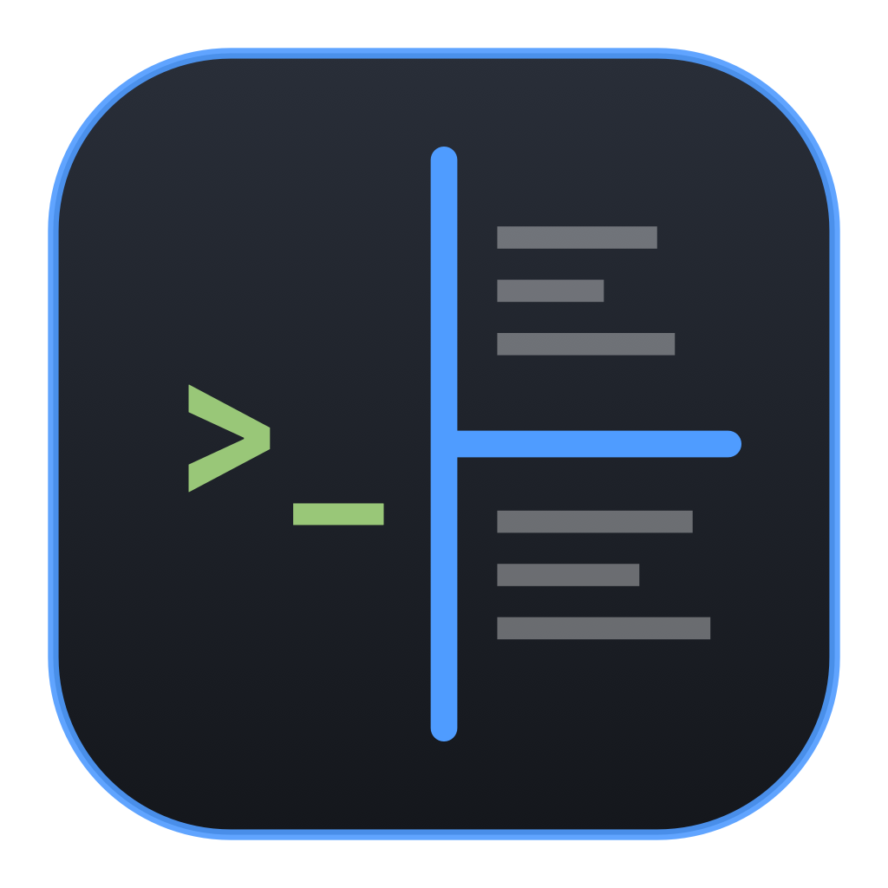
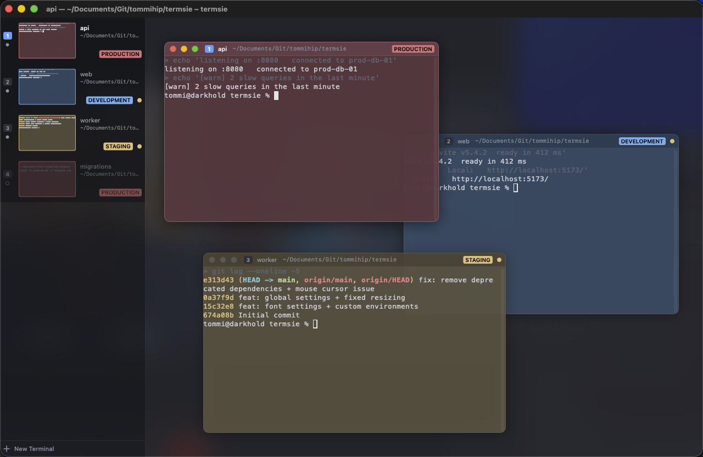
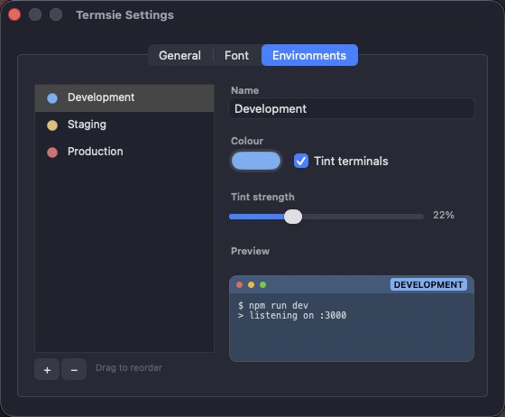

<div align="center">



# Termsie

**One window for everything you're running.**

A native macOS terminal built for developers who always have five things going at once:
an API, a bundler, a worker, a database shell, and somewhere a `tail -f`.

[](#requirements)
[](https://swift.org)
[](LICENSE)
[](#project-status)



</div>

---

## Why

Running six services means six terminal windows, and macOS gives you no help telling them apart.
They look identical, they hide behind each other, and the one that matters is always the one you
just lost. Tabs are worse: whatever is failing is on a tab you cannot see.

Termsie puts them all in **one window**, floating freely so you can arrange them the way the work
actually looks, with a panel down the side listing every terminal you have, what it is doing, and a
live picture of its screen. The one that just started printing red is the one you can see.

And because typing the wrong command into production is a genuinely bad afternoon, every terminal
can be tagged with an **environment** that colours it. Production is never mistaken for local
again.

## Features

|  |  |
| --- | --- |
| **Floating terminals** | Drag by the header, resize from any edge, overlap however you like. Edges snap to the window and to each other. Tile, cascade, or throw one to a half of the screen when you want order back. |
| **A terminal list that shows what is happening** | Every terminal, open or closed, with a live thumbnail of its screen, its working directory, and what is running in it. Drawn from the character buffer, so it costs almost nothing when idle. |
| **Environments** | Tag a terminal production, staging, development, or anything you define. Its background, header, badge and list row all take that colour. |
| **Saved terminals** | Each terminal keeps a working folder and commands to run on open, like activating a virtualenv. Close it and it stays in the list; click to bring it back exactly as it was. |
| **Its own command history** | Press Up in a terminal and you get what *you* typed *there*. No changes to your dotfiles required. |
| **Workspaces** | Save a whole window of terminals to a file. New, Save, Save As, and a prompt before you throw away unsaved changes. |
| **Genuinely native** | Swift and AppKit, GPU text rendering through Metal, translucency and blur like Terminal.app. No Electron, no web view. |

Plus native tabs, input broadcast to every terminal at once, scrollback search, per-terminal font
overrides, and a config file that reloads the moment you save it.

## Requirements

- macOS 14 or later (developed on macOS 26)
- Xcode command line tools with Swift 5.9+

## Install

There is no prebuilt release yet, so build it from source. It takes about a minute.

```bash
git clone https://github.com/tommihip/termsie.git
cd termsie
make run
```

| Command | What it does |
| --- | --- |
| `make app` | Builds `build/Termsie.app` (release) |
| `make run` | Builds it and opens it |
| `make install` | Copies it to `/Applications` |
| `make icon` | Regenerates the app icon |

`make app CONFIG=debug` builds a debug bundle. The first build fetches
[SwiftTerm](https://github.com/migueldeicaza/SwiftTerm).

## First run

You get one terminal and an empty list. From there:

- **⌘D** adds a terminal. Drag it by the header, resize it from any edge.
- **⌥⌘=** tiles everything into a grid when the arrangement gets away from you.
- Double-click a row in the list to give that terminal a **working folder**, **commands to run on
  open**, and an **environment**.
- **⌘S** saves the lot as a workspace you can reopen later.

## Keyboard shortcuts

| Action | Shortcut |
| --- | --- |
| New window / new tab | ⌘N / ⌘T |
| New terminal | ⌘D |
| New terminal, then tile everything | ⌃⌘D |
| Duplicate terminal | ⇧⌘D |
| Terminal settings | ⌘I |
| Set terminal name | ⌥⌘R |
| Close terminal / delete terminal | ⌘W / ⌘⌫ |
| Close window | ⇧⌘W |
| Toggle the terminal list | ⌃⌘S |
| Maximize terminal | ⇧⌘↩ |
| Tile grid / cascade | ⌥⌘= / ⌥⌘\ |
| Throw terminal to a half | ⌃⌥⌘← → ↑ ↓ |
| Bring to front / send to back | ⌥⌘F / ⌥⌘B |
| Focus terminal left / right / up / down | ⌥⌘← → ↑ ↓ |
| Next / previous terminal | ⌘] / ⌘[ |
| Jump to terminal 1–9 | ⌥⌘1 … ⌥⌘9 |
| Switch to tab 1–9 | ⌘1 … ⌘9 |
| Toggle terminal headers | ⇧⌘H |
| Broadcast input to all terminals | ⌥⌘I |
| Clear scrollback | ⌘K |
| Find / next / previous | ⌘F / ⌘G / ⇧⌘G |
| Bigger / smaller text (focused terminal) | ⌘= / ⌘- |
| Use the global font again | ⌘0 |
| New workspace | ⌥⌘N |
| Save workspace / save as | ⌘S / ⇧⌘S |
| Open workspace file | ⇧⌘O |
| Settings | ⌘, |

With the mouse: drag a header to move a terminal, drag its edges or corners to resize,
double-click the header to maximize, right-click it for a menu including its environment. The
three buttons at the top left close the terminal, roll it up to its header, and maximize it.
⌥⌘-drag anywhere inside a terminal also moves it, which is how you move one with headers hidden.
In the list, click a row to open or focus it, double-click for its settings, drag rows to reorder,
and use **+ New Terminal** at the bottom to add one.

Closing a terminal keeps it in the list. Deleting removes it for good. The window closes only when
its last terminal is deleted, so a window of saved-but-closed terminals is a normal state.

## Settings



**⌘,** opens Settings, which has three tabs.

**General** holds the global behaviour switches: whether terminals resize along with the window,
whether resizing snaps to whole character cells, whether the last session reopens on launch,
whether terminals show headers and window buttons, and whether closing a busy terminal asks first.

**Font** sets the global font every terminal starts from. Only fixed-pitch families are listed,
because a terminal draws on a character grid and a proportional font would misalign every column.

**Environments** is where you add your own. Each has a name, a colour, and a tint strength, with a
live preview beside it. Drag to reorder, and use **+** and **−** to add and remove. Changes are
written to `config.json` immediately and every open terminal repaints.

Removing an environment does not rewrite the terminals using it; they simply lose their tint, and
re-adding one with the same id brings the colour back. An environment keeps its internal id when
you rename it, so terminals stay attached.

### Fonts, globally and per terminal

The global font applies to every terminal that has not overridden it, so changing it in Settings
moves them all at once. A single terminal can override the family, the size, or just one of the
two, from its own settings in the list. ⌘= and ⌘- resize the focused terminal and save that as its
override; ⌘0 clears the override so it follows the global font again.

## Configuration

`~/.config/termsie/config.json` is created on first launch and reloaded whenever it changes.
Every key is optional.

```json
{
  "font": { "family": "Menlo", "size": 13 },
  "shell": null,
  "shellArgs": ["-l"],
  "scrollback": 10000,
  "renderer": "metal",
  "cursorStyle": "block",
  "bell": "visual",
  "optionAsMeta": true,
  "showPaneHeaders": true,
  "closePaneOnExit": "clean",
  "confirmClosingRunningProcess": true,
  "restoreSession": true,
  "resizeTerminalsWithWindow": true,
  "snapToCells": true,
  "opacity": 0.88,
  "activeOpacityBoost": 0.07,
  "blurBackground": true,
  "cornerRadius": 10,
  "trafficLights": true,
  "environments": [
    { "id": "development", "label": "Development", "tint": "#61afef" },
    { "id": "staging",     "label": "Staging",     "tint": "#e5c07b" },
    { "id": "production",  "label": "Production",  "tint": "#e06c75", "strength": 0.26 }
  ],
  "shellIntegration": "auto",
  "history": {
    "isolate": true,
    "size": null,
    "saveSize": null,
    "mergeToGlobalOnExit": true,
    "respectShareHistory": true,
    "retentionDays": 30
  },
  "startupCommands": { "mode": "shim", "echo": true, "recordInHistory": false },
  "sidebar": { "visible": true, "width": 264, "rowHeight": 84, "thumbnailRefreshMs": 500 }
}
```

- `shell`: `null` uses `$SHELL` (falls back to `/bin/zsh`).
- `renderer`: `"metal"` or `"coregraphics"`.
- `cursorStyle`: `block`, `bar`, `underline`, or the blinking variants `blinkBlock`, `blinkBar`,
  `blinkUnderline`.
- `closePaneOnExit`: `always`, `clean` (only on exit status 0), or `never`.
- `resizeTerminalsWithWindow` (also in Settings ▸ General): with `true` the terminals scale with
  the window, keeping your arrangement proportional. With `false` they keep their exact size and
  position, and only slide back into view far enough to stay reachable.
- `snapToCells`: rounds a resize to whole character cells, so the emulator only reflows when the
  grid actually changes. Turn it off if a resize ever feels sticky.
- `opacity`: how solid a terminal's background is. `activeOpacityBoost` is added to whichever
  terminal has focus; set it to `0` for uniform opacity. Set `opacity` to `1` and `blurBackground`
  to `false` for a fully opaque window.
- `environments`: your own list, in menu order. A `tint` of `null` means no colour; `strength` is
  how far the background is pulled toward the tint.
- `shellIntegration`: `"off"` disables the history and startup-command machinery entirely, and
  terminals launch exactly as a plain shell would.

Colors live under `colors`, including `sidebarBackground`, `sidebarSelection`, and the 16-entry
`ansi` palette.

Settings writes this file, so it is reformatted with sorted keys when you change something in the
UI, and any keys Termsie does not recognise are dropped on that write. Editing the file by hand
still works, and the app reloads it as soon as you save.

## Workspaces

A workspace is one tab's terminals: their folders, startup commands, environments, fonts and
positions. Workspaces live in `~/.config/termsie/workspaces/<name>.json` and appear under
**Workspaces ▸ Open Workspace**.

**New Workspace** (⌥⌘N) clears the tab back to a single empty terminal. **Save Workspace** (⌘S)
writes to the workspace you have open, asking for a name the first time; **Save Workspace As…**
(⇧⌘S) always asks, and can optionally fold in whatever each terminal is running right now.

The window subtitle shows which workspace you are in and whether it has unsaved changes. Moving
between terminals is not an edit: focus and stacking order change constantly, so they are excluded,
while adding, closing, renaming, moving and resizing terminals all count.

```json
{
  "version": 2,
  "name": "fullstack",
  "layout": {
    "version": 2,
    "terminals": [
      { "id": "t-fullstack-api", "name": "api", "cwd": "~/src/api", "environment": "production",
        "startupCommands": ["go run ./cmd/api"], "frame": [0, 0, 0.6, 0.5], "z": 0 },
      { "id": "t-fullstack-py", "name": "worker", "cwd": "~/src/worker",
        "startupCommands": ["source .venv/bin/activate", "python worker.py"],
        "frame": [0, 0.5, 0.6, 0.5], "z": 2 }
    ]
  }
}
```

`frame` is `[x, y, width, height]` as fractions of the window, measured from the top left, so a
workspace saved on a large display still opens sensibly on a laptop. `z` is the stacking order.
`openOnRestore: false` keeps a terminal in the list without starting it. `fontFamily` and
`fontSize` override the global font for that terminal alone. See `examples/workspace.json`.

Older files that used the original nested split-tree format still open; their panes become floating
terminals in the same positions. `examples/legacy-v1-workspace.json` is one.

Launch straight into a workspace or a directory:

```bash
open -a Termsie --args --workspace fullstack
open -a Termsie --args --cwd ~/src/example
```

## How it works

Some of this was more interesting than expected, and the reasoning is worth writing down.

### Per-terminal history without touching your dotfiles

Termsie generates a small startup directory per terminal and points `ZDOTDIR` at it. Those
generated files source your own `.zshenv`, `.zprofile`, `.zshrc` and `.zlogin` first, then pin
`HISTFILE` to that terminal's private file afterwards — which is what makes it survive setups like
oh-my-zsh that assign `HISTFILE` themselves. `ZDOTDIR` is handed back to its original value before
your shell reaches the prompt, so nested shells and tools are unaffected.

The trap: setting `ZDOTDIR` makes zsh skip `~/.zshenv` *entirely*. A shim that does not source it
back silently strips whatever that file sets up, commonly half your `PATH`. `scripts/test-shim.sh`
exists to prove that never happens.

Startup commands run from that same shim, once, just before the first prompt. They are echoed dim
so their output is never unattributed, and kept out of your history. They are not typed into the
terminal, which matters: typing several commands at once feeds later lines into the standard input
of whatever the earlier one started.

Bash gets `HISTFILE` plus a one-shot prompt hook; fish gets its own session history; any other
shell gets `HISTFILE` alone. Anything unrecognized or ambiguous falls back to leaving your shell
completely untouched — a terminal with shared history is a missing feature, a terminal with a
broken `PATH` is a broken app.

### Thumbnails that cost nothing

Thumbnails are drawn from each terminal's character buffer, not captured from the screen. The
terminals render through Metal, and the usual view-snapshot APIs return blank where a Metal layer
is; screen capture would work but demands a permission prompt for a sidebar picture.

Redrawing is gated so an idle window does no periodic work: a thumbnail is only considered when its
terminal produced output, only for rows on screen, and only when a per-row content fingerprint has
changed. The shared refresh timer stops itself after a few quiet ticks.

Each terminal's header and row also show what is running and where, by asking the kernel for the
shell's working directory and the terminal's foreground process group every 1.5 seconds. Two cheap
syscalls, no shell hooks, works for any shell.

### The pointer knows which terminal is in front

AppKit's cursor rectangles are registered per view and resolved without regard to what is drawn on
top. With terminals that overlap, that let a terminal behind claim the pointer over the header of
the terminal in front. Termsie turns cursor rectangles off for its windows and sets the pointer
from a single place, resolving overlap with `hitTest` — the same mechanism that already decided
which terminal a click belongs to.

### Fonts

Interface text goes through `UIFonts`, which resolves each face once and caches it. That is not
micro-optimisation: `NSFont.systemFont(ofSize:weight:)` and its monospaced siblings are declared
non-null, so Swift types them non-optional, but under repeated calls from a draw loop they have
been observed returning nil — which then detonates deep inside CoreText, far from the cause.

## Development

```
Sources/Termsie/
  App/        AppDelegate, MainMenu, Config (JSON + file watcher), DebugDriver, WindowCapture, UIFonts
  Model/      TerminalDefinition (the saved terminal), TerminalRegistry (definitions ↔ live panes)
  Window/     TerminalWindowController — lifecycle, focus, menus, workspace and session plumbing
  Layout/     PaneCanvasView (floating terminals), PaneChrome (hit zones), Arrange (tile/cascade),
              LayoutTree (legacy v1 decode only)
  Terminal/   TerminalPane, TermsieTerminalView, PaneHeaderView, TrafficLightsView, FindBarView,
              ProcessInspector, ShellIntegration + ShimScripts (history and startup commands)
  Sidebar/    TerminalSidebarView, TerminalRowView, SidebarFooterView, ThumbnailRenderer,
              ThumbnailSource, TerminalSettingsPopover, SidebarContainerView, BadgeDrawing
  Session/    WorkspaceStore (v2 format), LegacyMigration (v1 split trees → terminals)
  Settings/   SettingsWindowController (general, font, environments), SettingsForm, FontCatalog
```

### Tests

```bash
./scripts/test-shim.sh   # the shell shim, before the app is ever launched
./scripts/test-app.sh    # the app, driven headlessly
```

`test-shim.sh` compares a native `zsh -li` against a shimmed one and requires the exported
environment to be identical apart from the history variables, then proves history isolation over
real pseudo-terminals with `expect`.

`test-app.sh` drives the real app and checks thumbnail correctness and cost, session migration,
terminal lifecycle, startup commands, dragging and snapping, translucency, collapse, environments,
font inheritance, workspace state, and pointer ownership where terminals overlap.

Both use throwaway fixture directories and never touch your real configuration.

The app can drive itself, which is how the tests work:

```bash
Termsie --snapshot out.png --actions newTerminalAction,type:ls\n,tileGrid --quit
Termsie --emit-shim /tmp/shim     # writes the generated shell files without launching
```

`--snapshot` goes through ScreenCaptureKit, the only way to read the Metal-rendered terminals, so
it needs Screen Recording permission and captures the window alone. Nothing else in the app uses
screen capture, so running Termsie normally never asks for that permission.

## Project status

Termsie is young and moving quickly. It is used daily by its author, but it has not been through
many hands yet, so expect rough edges and occasional breaking changes to the config format before
1.0. Bug reports with a crash log or the steps that produced the problem are extremely welcome.

There is no prebuilt release and no notarised binary yet.

## Contributing

Issues and pull requests are welcome at
[github.com/tommihip/termsie](https://github.com/tommihip/termsie).

A few things that make a change easy to accept:

- Run both test scripts before opening a pull request. If you touch the shell integration,
  `test-shim.sh` is not optional — a mistake there breaks every terminal's shell.
- Add a check to `scripts/test-app.sh` for behaviour you add. Almost everything is reachable
  through the `--actions` harness, so most features can be tested without a human watching.
- Explain *why* in comments where the reason is not obvious from the code. Much of this codebase
  is working around behaviour that is surprising until someone writes it down.

## Acknowledgements

Termsie stands on [SwiftTerm](https://github.com/migueldeicaza/SwiftTerm) by Miguel de Icaza, an
excellent terminal emulator for Swift, which itself descends from
[xterm.js](https://github.com/xtermjs/xterm.js). SwiftTerm is MIT licensed.

## License

Apache License 2.0. See [LICENSE](LICENSE).
